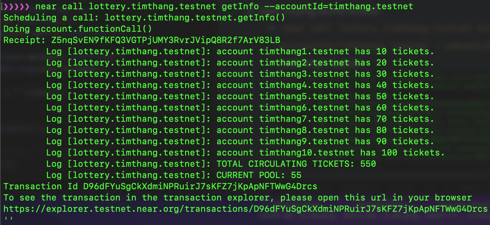

advanced-lottery
==================

DESCRIPTION
===============

1. Any account can buy "Tickets" to take part in the lottery, with the rate of 1 NEAR = 10 Tickets. the more tickets you have, the more chance you have to win the pot.
   
   -  to buy tickets: `near call <contractName> buyTickets --accountId=<your_account.testnet> --amount=<amount in NEAR you want to buy>`
  
2. Everytime someone buys tickets, the amount of NEAR they used to buy gets added to the "pool", the winner of the lottery will receive 95% of this pool, 5% to the host (contract account).
3. There's a special rule: top 5% accounts with lowest tickets in balance will not be able to take part in the lottery, and that amount of tickets will be sent to the top #1 account with highest tickets in balance as a bonus. In case there's no one holding less than 5% of the total tickets in circulation, the account holding lowest tickets will not be able to take part in the lottery, and its tickets will be sent to the #1 account. So you should not be in the top lowest tickets balance accounts if you want a chance to win the lottery.

4. To start the lottery, call the `play()` function in the smart contract:
   
   - `near call <contractName> play --accountId=<your_account.testnet>` 

DEMO (CLI)
===============
1. `yarn deploy` 
   - deploy contract to `lottery.timthang.testnet` 
2. start buying some tickets
   - `near call lottery.timthang.testnet buyTickets --accountId=timthang1.testnet --amount=1` : buy 10 tickets for account timthang1.testnet
  
   - buy some more and call `getInfo()`:
   
3. start the lottery and get the winner, send 95% pool to the winner and reset the lottery:
   
   - (note: set `--gas` tag to 300000000000000 to access more blockchain storage)
*this dApp currently only has CLI version, the frontend is not available as of now.*

Quick Start
===========

To run this project locally:

1. Prerequisites: Make sure you've installed [Node.js] ≥ 12
2. Install dependencies: `yarn install`
3. Run the local development server: `yarn dev` (see `package.json` for a
   full list of `scripts` you can run with `yarn`)

Now you'll have a local development environment backed by the NEAR TestNet!

Go ahead and play with the app and the code. As you make code changes, the app will automatically reload.

Exploring The Code
==================

1. The "backend" code lives in the `/contract` folder. See the README there for
   more info.
2. The frontend code lives in the `/src` folder. `/src/index.html` is a great
   place to start exploring. Note that it loads in `/src/index.js`, where you
   can learn how the frontend connects to the NEAR blockchain.
3. Tests: there are different kinds of tests for the frontend and the smart
   contract. See `contract/README` for info about how it's tested. The frontend
   code gets tested with [jest]. You can run both of these at once with `yarn
   run test`.

Deploy
======

Every smart contract in NEAR has its [own associated account][NEAR accounts]. When you run `yarn dev`, your smart contract gets deployed to the live NEAR TestNet with a throwaway account. When you're ready to make it permanent, here's how.

Step 0: Install near-cli (optional)
-------------------------------------

[near-cli] is a command line interface (CLI) for interacting with the NEAR blockchain. It was installed to the local `node_modules` folder when you ran `yarn install`, but for best ergonomics you may want to install it globally:

    yarn install --global near-cli

Or, if you'd rather use the locally-installed version, you can prefix all `near` commands with `npx`

Ensure that it's installed with `near --version` (or `npx near --version`)

Step 1: Create an account for the contract
------------------------------------------

Each account on NEAR can have at most one contract deployed to it. If you've already created an account such as `your-name.testnet`, you can deploy your contract to `advanced-lottery.your-name.testnet`. Assuming you've already created an account on [NEAR Wallet], here's how to create `advanced-lottery.your-name.testnet`:

1. Authorize NEAR CLI, following the commands it gives you:

      near login

2. Create a subaccount (replace `YOUR-NAME` below with your actual account name):

      near create-account advanced-lottery.YOUR-NAME.testnet --masterAccount YOUR-NAME.testnet

Step 2: set contract name in code
---------------------------------

Modify the line in `src/config.js` that sets the account name of the contract. Set it to the account id you used above.

    const CONTRACT_NAME = process.env.CONTRACT_NAME || 'advanced-lottery.YOUR-NAME.testnet'

Step 3: deploy!
---------------

One command:

    yarn deploy

As you can see in `package.json`, this does two things:

1. builds & deploys smart contract to NEAR TestNet
2. builds & deploys frontend code to GitHub using [gh-pages]. This will only work if the project already has a repository set up on GitHub. Feel free to modify the `deploy` script in `package.json` to deploy elsewhere.

  [React]: https://reactjs.org/
  [create-near-app]: https://github.com/near/create-near-app
  [Node.js]: https://nodejs.org/en/download/package-manager/
  [jest]: https://jestjs.io/
  [NEAR accounts]: https://docs.near.org/docs/concepts/account
  [NEAR Wallet]: https://wallet.testnet.near.org/
  [near-cli]: https://github.com/near/near-cli
  [gh-pages]: https://github.com/tschaub/gh-pages
